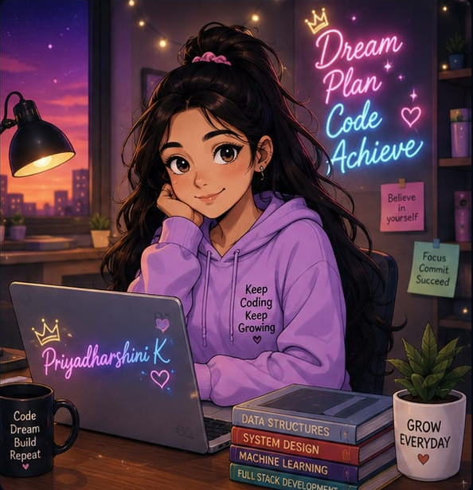

<div align="center">


</div>

<br/>



```python
class Priyadharshini:
    def __init__(self):
        self.name = "Priyadharshini K"
        self.location = "Namakkal, Tamil Nadu, India"
        self.degree = "B.E. Computer Science and Engineering, 2024-2028"
        self.stack = ["Python", "Java", "C", "HTML", "CSS"]
        self.currently_learning = ["MERN Stack", "Machine Learning", "DSA"]
        self.fun_fact = "Completed a MERN stack internship before finishing sophomore year!"

    def motto(self):
        return "Continuously learning, continuously building."

me = Priyadharshini()
print(me.motto())
```

<br clear="right"/> 


**Languages**

  

**Web Technologies**

 

**Currently Exploring**

   

**Tools**

  

<br/>


<div align="center">

<a href="https://github.com/priyadharshinikannan14">
  
</a>
<a href="https://github.com/priyadharshinikannan14">
  
</a>

</div>

<br/>

<div align="center">


</div>

<br/>

<div align="center">


</div>

<br/>


<div align="center">


</div>

<br/>


<details>
<summary><b>MERN Full Stack Development Intern @ Altruisty Innovation Pvt Ltd</b> — May 2026 to Jun 2026 | Remote/On-site</summary>
<br/>

> `MongoDB` `Express.js` `React` `Node.js` `JavaScript`

- Completed a 1-month intensive internship focused on the MERN (MongoDB, Express, React, Node.js) full stack development workflow.
- Gained hands-on exposure to building and structuring full stack web applications from front end to back end.
- Strengthened practical understanding of REST-based application architecture and modern JavaScript tooling.
- Applied classroom fundamentals in DSA and OOP to real-world development tasks under an internship setting.

</details>

<br/>


> Currently building my project portfolio — check back soon! In the meantime, here's what I've been working with hands-on:

<div align="center">

| Project | Stack | Highlights |
|---|---|---|
| *Coming soon* | MERN (MongoDB, Express, React, Node.js) | Applying skills from my MERN internship to build my first full stack project |

</div>

<br/>


<div align="center">

| 🏆 | Achievement | Details |
|---|---|---|
| 🎓 | Strong Academic Record | Current CGPA: **8.72/10** across 3 semesters |
| 📜 | NPTEL – Internet of Things (IoT) | Certified with a score of **72%** |
| 📜 | NPTEL – Leadership & Team Effectiveness | Certified with a score of **58%** |
| 💻 | MERN Full Stack Internship | Completed 1-month internship at Altruisty Innovation Pvt Ltd |
| 📈 | Consistent CGPA Growth | Sem I: 8.05 → Sem II: 9.18 → Sem III: 8.92 |

</div>

<br/>


<div align="center">

| Degree | Institution | Year | Score |
|---|---|---|---|
| B.E. Computer Science and Engineering | Karpagam College of Engineering, Coimbatore | 2024 – 2028 | CGPA: 8.72/10 |
| Higher Secondary Education | Little Angels Higher Secondary School, Namakkal | 2022 – 2024 | 79.5% |
| Secondary Education | Little Angels Matric High School, Namakkal | 2021 – 2022 | 91.8% |

</div>

<br/>


```
🧱 MERN Stack        → MongoDB, Express.js, React, Node.js
🧠 Machine Learning   → Fundamentals, Data Preprocessing, Model Building
🧮 DSA & DAA          → Algorithm Design, Complexity Analysis
🌐 IoT                → Sensors, Connectivity, Applications
```

<br/>


- 🌍 Based in Namakkal, Tamil Nadu, India
- 💬 Interested in AI, Machine Learning, Data Science, Web Development & IoT
- 🗣️ Speak Tamil (native) and English (professional proficiency)
- 🎯 Currently sharpening my full stack development and ML fundamentals
- 📫 Reach me at **priyadharshinikannan1403@gmail.com**
- 🔗 Connect with me on [LinkedIn](https://www.linkedin.com/in/priyadharshini-k-60a3b8331)
- 📖 Hobbies: Reading, learning new technologies, listening to music, travelling, and community involvement

<br/>

<div align="center">


</div>


